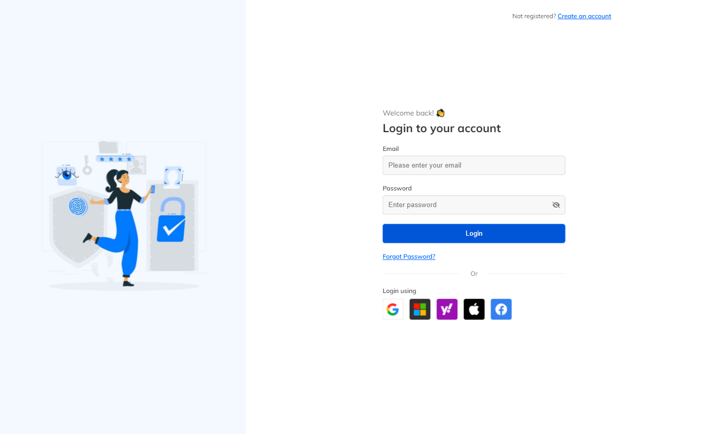

# Login-page demo using HTML & CSS
- This is a simple login-page demo using HTML & CSS.
- I could have used Bootstrap or Tailwind but I wanted to show my CSS skills without using any library.
- I have used CSS Flexbox for the layout.
- Tablet and mobile responsive.
- Vertical and horizontal centering for laptop and desktop.
- CSS variables are used for colors and fonts.
- Animations are used for a nice user experience.

## How to see the demo
Open [this link](https://AbdKayali3.github.io/login-page-demo/) to see the demo.

Or you can clone the repo and open the index.html file in your browser.

